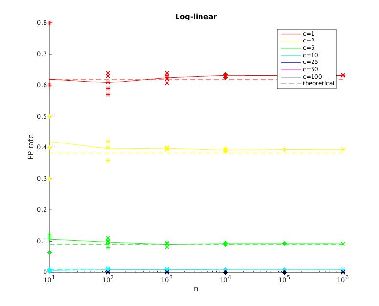
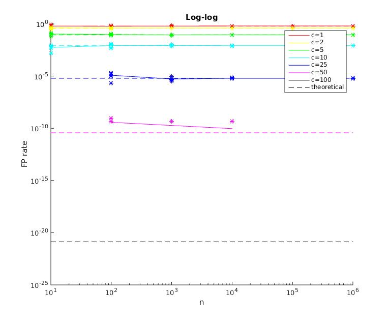

# Bloom Filter

This project implements a [Bloom filter](https://en.wikipedia.org/wiki/Bloom_filter), a datastructure for keeping track of whether an element is in a set, using only constant space by allowing an infinitesimal portion of false positives.

[`bf.tex`](https://pavelkomarov.com/bloom-filter/bf.tex) is the actual report. Compiles to [`bf.pdf`](https://pavelkomarov.com/bloom-filter/bf.pdf). I recommend reading this.

The assignment description is [`Project-BloomFilters.pdf`](https://pavelkomarov.com/bloom-filter/Project-BloomFilters.pdf).

[`Analysis.java`](https://pavelkomarov.com/bloom-filter/Analysis.java) tests my hash function to ensure it's uniform. It outputs data read and plotted with [`Analysis.m`](https://pavelkomarov.com/bloom-filter/Analysis.m). That yields the noise and histogram plots.

[`BloomFilter.java`](https://pavelkomarov.com/bloom-filter/BloomFilter.java) implements the actual Bloom Filter and outputs data from simulations across several values for parameter `c`. [`BloomFilter.m`](https://pavelkomarov.com/bloom-filter/BloomFilter.m) reads and plots this data, yielding plots:  
